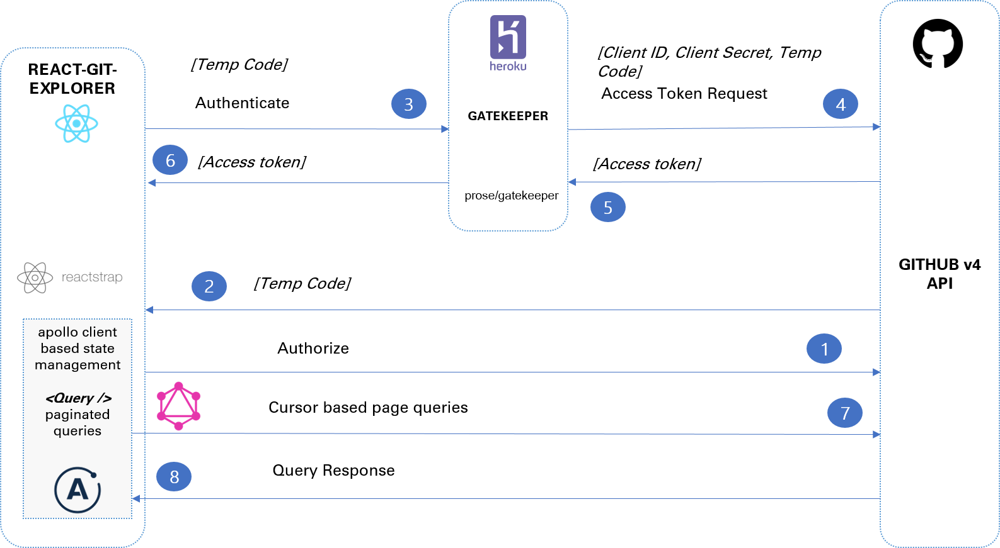

# React Git Explorer

[](https://deepscan.io/dashboard#view=project&pid=2879&bid=21481)

- This app aim
  - To use the apollo graphql client to extract github data via its GraphQL APIs
  - Infinite scroll where github project cards will be displayed.

## Live Demo

- See the live [Demo](https://affectionate-keller-d4f61b.netlify.com)

## Blog Post

- Read about the details of the implementation in the [published blog on Medium.com](https://medium.com/@tksukhu/get-your-github-organization-statistics-using-graphql-apollo-client-and-react-35839f580acf)

## Technology Approach



## setup

```bash
yarn install
```

## environment setup

This application relies on the Github OAuth flow and uses the [Gatekeeper](https://github.com/prose/gatekeeper) project

- Register this app as an OAuth App for github, specify the application url and redirect url and note down the client Id and client secret
- Follow the instructions in the Gatekeeper project and deploy the Gatekeeper on a cloud platform like Heroku or Azure with the app configuration details.

- Add the app github OAuth Client ID, Redirect URI and GATEKEEPER URI to .env.development|production.local

```
REACT_APP_CLIENT_ID=<GITHUB OAUTH TOKEN>
REACT_APP_REDIRECT_URI=<DEPLOYED APP URI>
REACT_APP_GATEKEEPER_URI=<GATEKEEPER HEROKU APP URI>
```

Sample URIs

```
REACT_APP_CLIENT_ID=xxxxxxxxxxxxxxx
REACT_APP_REDIRECT_URI=https://xxxxxx.netlify.com/
REACT_APP_GATEKEEPER_URI=https://xxxxx-gatekeeper.herokuapp.com
```

- Note: Avoid adding '/' suffix in the REACT_APP_GATEKEEPER_URI

- For more details, read the excellent blog from Julian that describes the OAuth process with [Gatekeeper](https://www.graphql.college/implementing-github-oauth-flow-in-react/)

## run

```bash
yarn start
```

## build in production mode

```bash
yarn build
```

### Sample screenshot


## Credits

- The github fork ribbon concept used in the project is based on [github-corners](https://github.com/tholman/github-corners)
