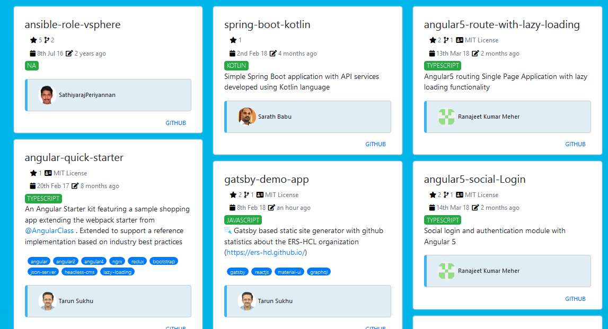

# React Git Explorer

* This app aim
  * To use the apollo graphql client to extract github data via its GraphQL APIs
  * Infinite scroll where github project cards will be displayed.

## setup

```bash
yarn install
```

## environment setup

Add the github token env variable to .env.development.local

```
REACT_APP_GITHUB_TOKEN=<GITHUB OAUTH TOKEN>
```

## run

```bash
yarn start
```

## build in production mode

```bash
yarn build
```

### Sample screenshot



